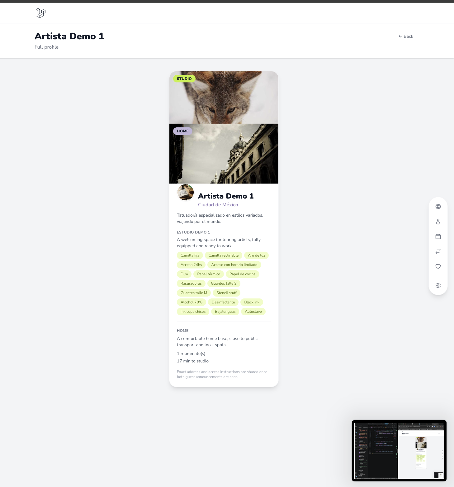
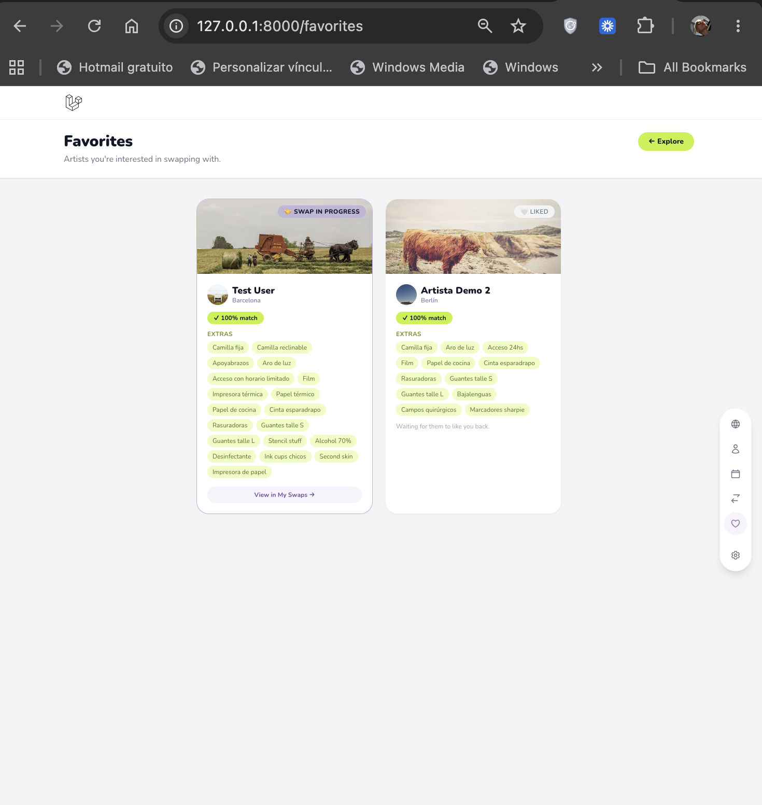
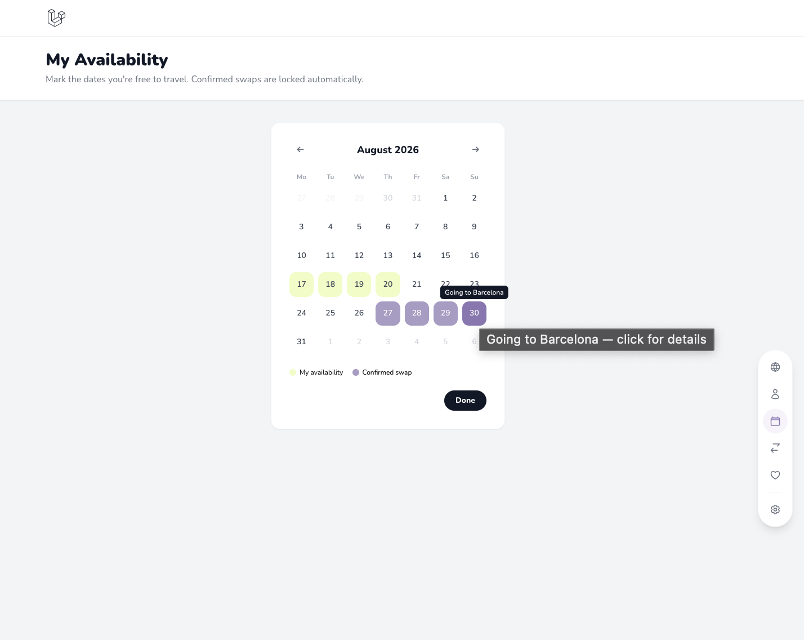
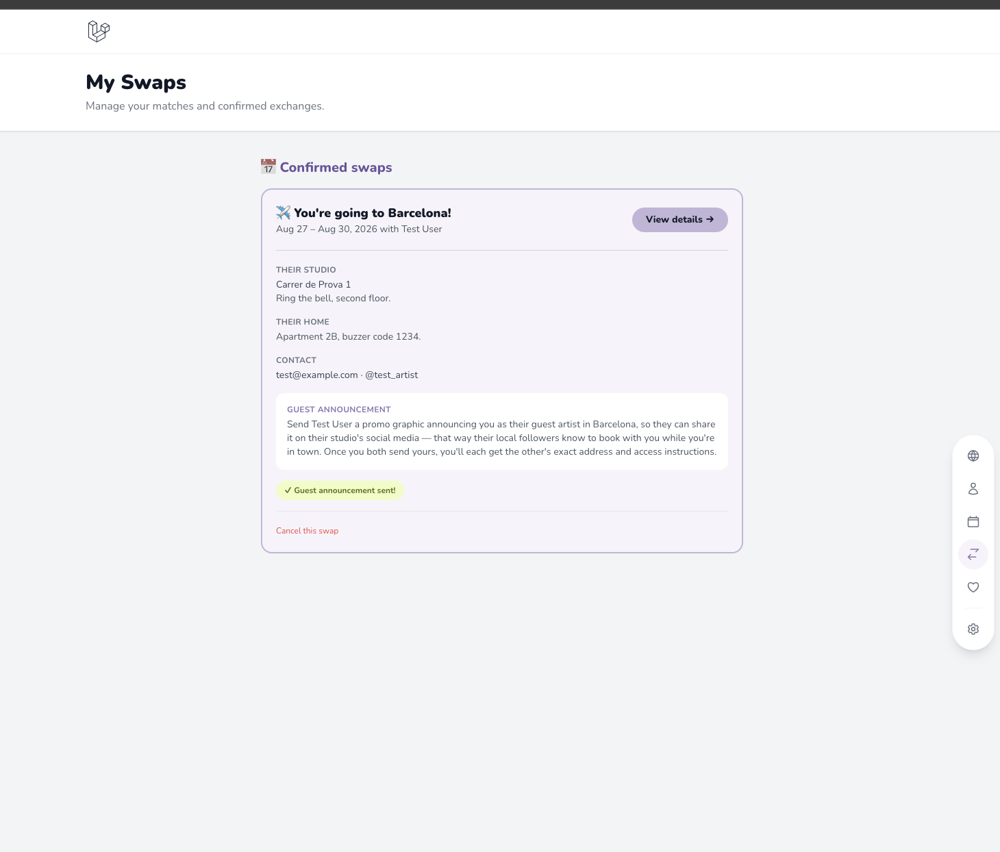
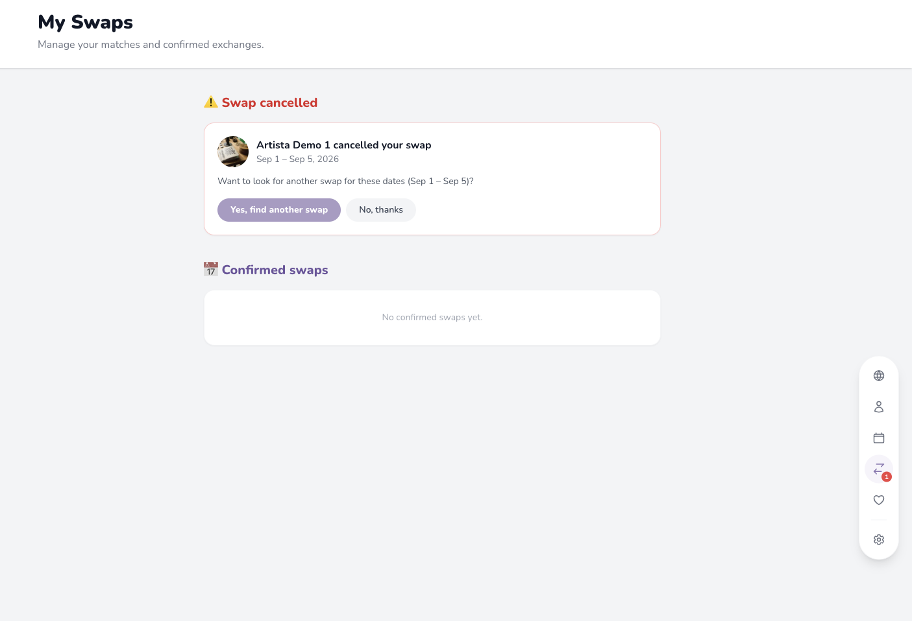
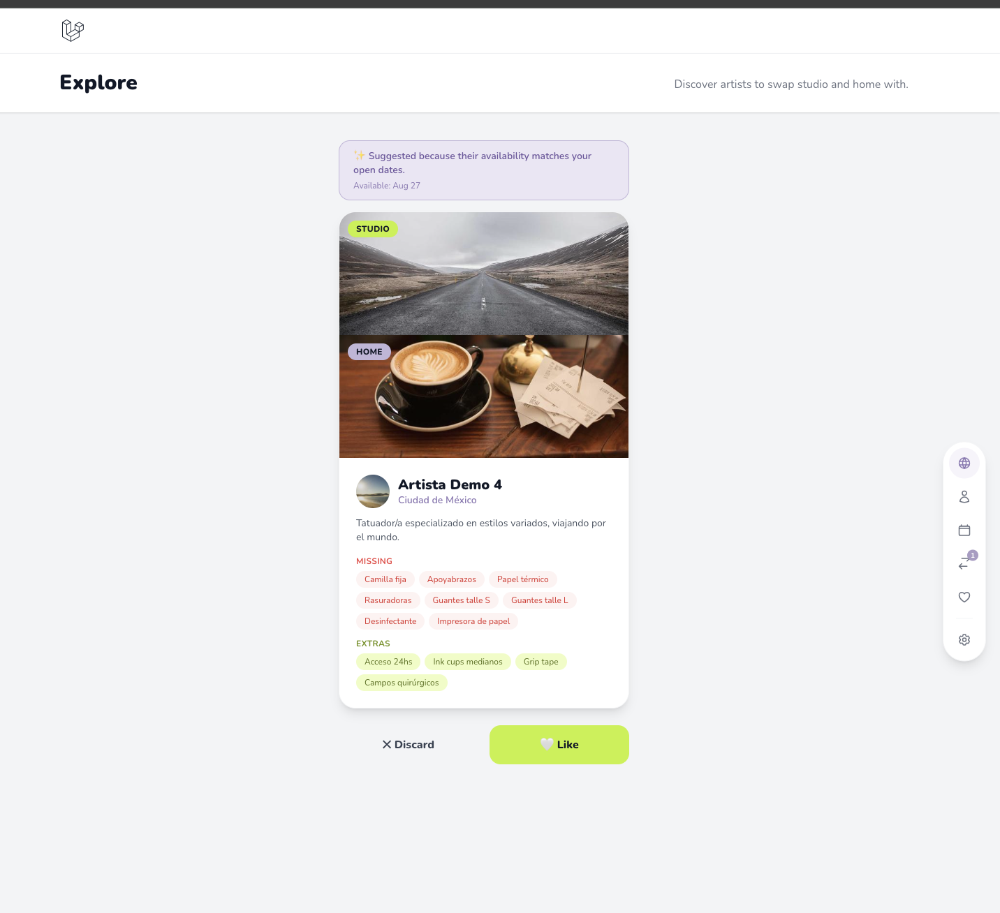
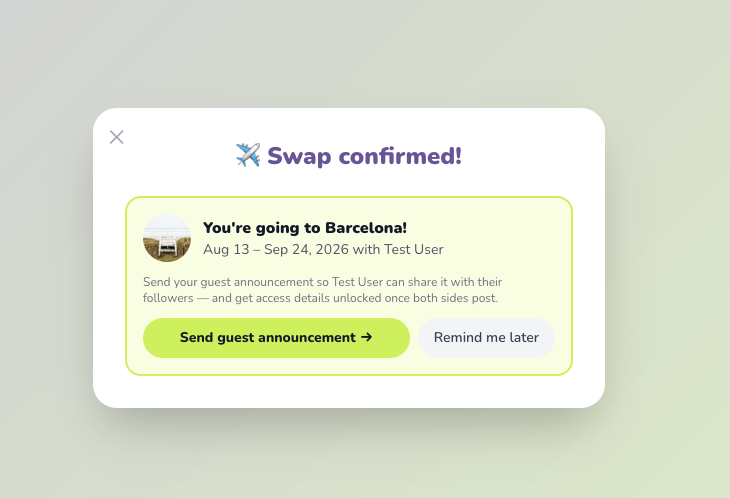

# TattooArtist Swap 🎨✈️

ArtistSwap es una aplicación para _tatuadores_ que viajan intercambiando estudio+hogar, con artistas de otras ciudades.


## 📱 Nota de diseño: pensada para app móvil

La UI está diseñada para pantallas de móvil — layouts angostos centrados, dock de navegación flotante lateral, tarjetas en Explore, y flujos paso a paso pensados para navegar con el pulgar.


## Stack técnico

- **Backend**: Laravel 13
- **Frontend**: Livewire + Alpine.js + Tailwind CSS
- **Base de datos**: MySQL
- **Autenticación**: Laravel Breeze
- **Tipografía**: Nunito
- **Paleta**: Lavanda + Verde lima


## Objetivos de la consigna cubiertos

- ✅ Patrón MVC (Modelo-Vista-Controlador)
- ✅ Modelos y migraciones completos (11 migraciones base + 8 migraciones incrementales)
- ✅ Eloquent ORM (relaciones, scopes, query builder, eager loading)
- ✅ Autenticación de usuarios (Laravel Breeze)
- ✅ Livewire
- ✅ **Capa de servicio** (`app/Services/SwapService.php`) como ampliación de la arquitectura MVC — toda la lógica de negocio de un swap (crear, confirmar, cancelar, recalcular fechas) vive separada del modelo y del controlador
- ✅ CRUD de perfil de artista (estudio + hogar + features)
- ✅ Repositorio en GitHub con **gitflow**


## Modelo de datos (MER actual)

-->


## Funcionalidades principales

### Perfil de artista
- Cada artista publica en su perfil, su estudio + su hogar (con fotos, características y descripciones). CRUD completo (crear, ver, editar, eliminar) del perfil
- Selección de features de espacio de trabajo por categoría (must-have / additional). Acciones rápidas ("marcar todos los must-haves", "copiar de mi estudio")
- Vista previa de mi perfil como lo ven otrxxs artistas en Explore.

  

### Explorar y matchear
- Exploración de artistas de a unx (estilo swipe), con comparación de features en común/faltantes
- Like / Descartar
- Detección de match mutuo con pop-up animado
- Favoritos con distinción visual: Liked / Match / Swap en progreso / Swap confirmado




### Coordinar el swap
- Calendario de disponibilidad general (Livewire), con comparación visual contra la disponibilidad del otrx artista
- Cálculo automático de fechas en común
- Doble confirmación de fechas
- Calendario de viajes confirmados, con bloqueo automático de días. Click para ver detalles del intercambio




### Post-confirmación
- Intercambio de gráfica de "guest artist" antes de revelar datos sensibles
- Recordatorio visual si faltan ≤7 días para el swap y la gráfica no fue enviada




### Ciclo de vida de un `Swap`

1. **Match mutuo** (like cruzado) → botón "Set Dates" crea un swap en `pendiente`, sin fechas.
2. **Ambos marcan disponibilidad general** → el sistema calcula automáticamente la intersección de fechas (`SwapService::recalculateDates`).
3. **Doble confirmación** → cada artista debe confirmar el rango calculado. Si algunx agrega/quita disponibilidad, el rango se recalcula y ambas confirmaciones se vuelven a verificar.
4. **`aceptado`** → cuando ambxs confirmaron. Se dispara un pop-up de celebración para ambxs, y las fechas quedan bloqueadas en el calendario de cada unx.
5. **Guest announcement** → antes de revelar dirección/instrucciones de acceso, cada artista confirma que envió al otro una gráfica para redes sociales.


6. **Cancelación** (opcional, en cualquier momento tras confirmar) → un artista puede cancelar un swap `aceptado`, con mensaje opcional. El otro recibe un aviso con badge rojo, y puede elegir "buscar otro swap para esas fechas" (lo que prioriza en Explore a artistas con disponibilidad que coincida) o descartar el aviso.





### Notificaciones
- Badge lavanda: acciones pendientes (marcar disponibilidad, confirmar fechas, enviar gráfica)
- Badge rojo: cancelación
- Pop-ups: nuevo match, swap confirmado




## Instalación

### Requisitos
- PHP 8.2+
- Composer
- Node.js + npm
- MySQL

### Pasos

```bash
git clone https://github.com/hricheri/Sprint-4---Tattoo-app.git
cd Sprint-4---Tattoo-app

composer install
composer require doctrine/dbal   # necesario para migraciones que modifican columnas existentes

npm install
npm run build                    # o `npm run dev` mientras desarrollás

cp .env.example .env
php artisan key:generate
```

Configurá tu conexión a MySQL en `.env`, y luego:

```bash
php artisan migrate --seed
```

Esto crea la base de datos y la puebla con:
- Un usuario de prueba (`test@example.com`)
- 6 artistas demo (`demo1@example.com` a `demo6@example.com`)
- Disponibilidad aleatoria para cada uno (para poder probar el matching de fechas sin cargar datos manualmente)
- Algunos likes iniciales entre el usuario de prueba y los demos

```bash
php artisan serve
```

La app queda disponible en `http://127.0.0.1:8000`.
